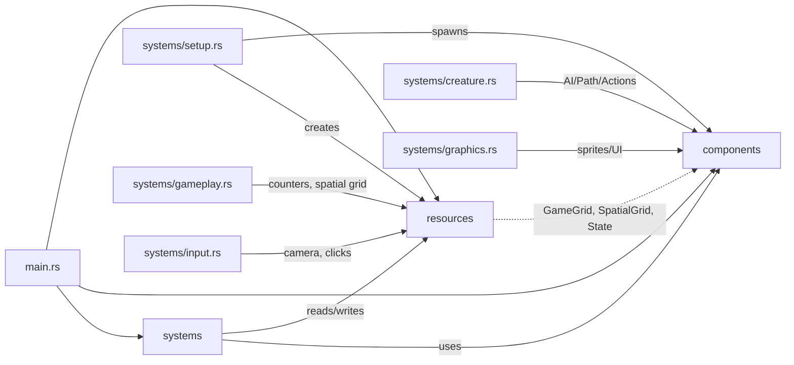
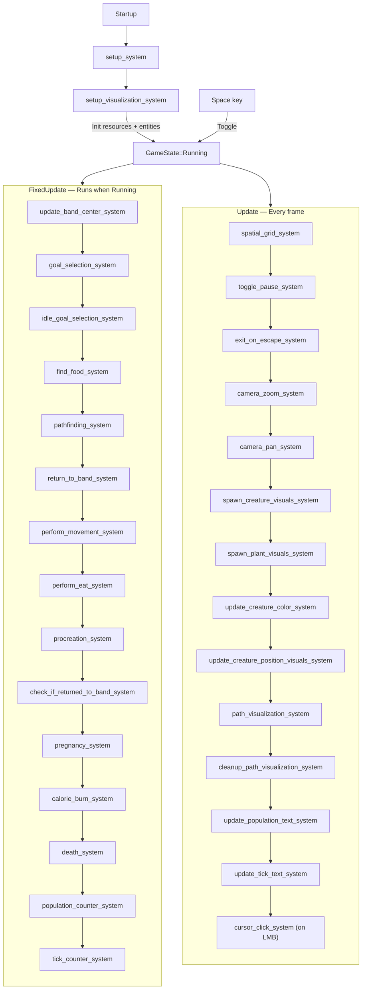
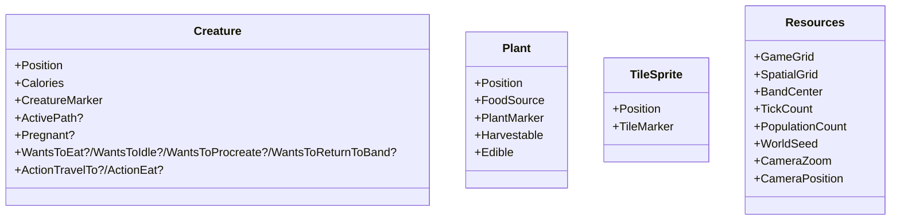
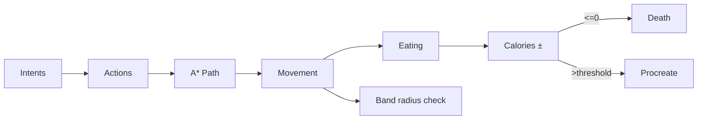
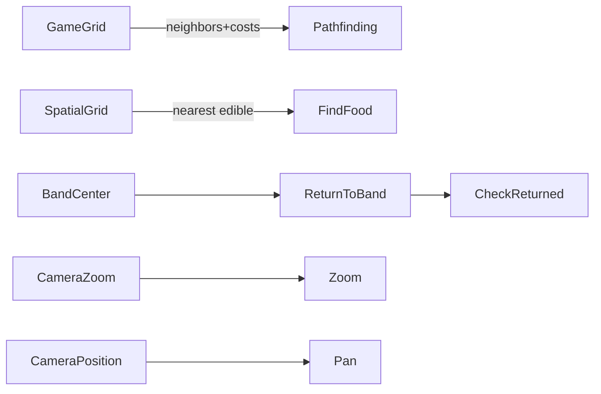

## Guns, Germs, and Steel -- Game Overview

This document is a concise overview to help a new developer quickly understand the design, architecture, and game flow of this Bevy-based simulation. It includes embedded Mermaid diagrams where useful.

### 1) Project overview
- **Engine**: Bevy 0.16 (ECS, 2D sprites, input, states, fixed timestep)
- **Concept**: Top‑down grid world with creatures that eat wheat, reproduce, move via A*, and die if calories deplete
- **Loop**: Simulation logic runs on FixedUpdate ticks; visuals and input run per‑frame on Update
- **Entry**: `src/main.rs`; constants in `src/constants.rs`

### 2) Architecture and project structure
- `src/main.rs`: App setup, schedules, system registration
- `src/components/`: ECS components and markers
- `src/resources/`: Global resources (grid, state, counts, camera, seed)
- `src/systems/`: Systems grouped by domain (setup, gameplay, creature AI, graphics, input, UX)
- `assets/sprites/`: Unit and tile overlay images

### 3) Scheduling and game state
- Schedules
  - Startup: world generation, camera/UI init, initial spawns
  - FixedUpdate (when `GameState::Running`): simulation tick chain (AI, pathfinding, actions, metabolism, pregnancy, death, counters)
  - Update: per‑frame systems (spatial grid, input, camera, visuals, UI text, path viz)
- State: `GameState` (`Running`/`Paused`), toggled with Space

Notes:
- `Time::<Fixed>::from_hz(TICK_RATE_HZ)` defines simulation tick rate (default 2 Hz).
- The spatial grid is rebuilt every frame; AI uses it during FixedUpdate to find nearby food.

### 4) Data model: components and resources
- Components (selected)
  - Position (i32 x/y grid), Calories (current/max), FoodSource
  - Intents: `WantsToEat`, `WantsToIdle`, `WantsToProcreate`, `WantsToReturnToBand`
  - Actions: `ActionTravelTo {destination}`, `ActionEat {target_entity, progress, max_progress}`
  - Movement: `ActivePath { nodes: Vec<Position> }`
  - Status/markers: `CreatureMarker`, `PlantMarker { PlantType }`, `Harvestable`, `Edible`, `Pregnant`, `OutsideBandRadius`, `TileMarker`, `PathVisualizationEnabled`, `PathMarker { creature_entity }`, UI markers (`TickText`, `PopulationText`)
- Resources
  - `GameGrid { tiles: Vec<Vec<Tile>> }` with `Tile { kind, move_cost }`
  - `SpatialGrid(HashMap<Position, Vec<Entity>>)` for quick occupancy lookups
  - `BandCenter(Position)`, `TickCount(u32)`, `PopulationCount(u32)`, `WorldSeed(u32)`
  - Camera: `CameraZoom(f32)`, `CameraPosition(Vec2)`
- Configuration
  - `src/constants.rs` covers grid/window sizes, tick rate, world gen thresholds, movement costs, pregnancy duration, band radius, headband colors

### 5) Gameplay flow (tick)
- Intent selection: If outside band radius → return; else if hungry → eat; else if well‑fed and not pregnant → procreate; else idle
- Intent to action: Idle picks a neighbor tile randomly; Eat finds nearest available plant; Return sets `ActionTravelTo` band center
- Pathfinding: A* over `GameGrid` with costs (water very expensive)
- Action execution: movement consumes MOVE_COST; eating consumes WORK_COST until complete, then grants nutrition and despawns plant
- Metabolism & lifecycle: burn calories each tick; pregnancy progresses and spawns a new creature when done; death on <= 0 calories
- Counters and band: population and tick counters updated; band center is average of creature positions

### 6) Rendering & UX (frame)
- Sprites: creature base sprite + headband child sprite; plants use wheat sprite; tiles colored per kind
- Positions: world coordinates derived from grid (`TILE_SIZE`, map centered at origin)
- UI text: tick and population updated when resources change
- Optional path visualization: toggled per‑creature via click; markers are ephemeral and cleaned up

### 7) Input & camera
- Input: Space toggles pause; Escape exits; Left click selects a tile and toggles path viz for creatures under cursor (also logs plant info)
- Camera zoom: mouse wheel adjusts `CameraZoom` clamped between `MIN_ZOOM` and a map‑fit max
- Camera pan: WASD moves camera with bounds so the viewport never goes outside the map (unless map is smaller than viewport)

### 8) Build & run
- Requirements: Rust toolchain
- Run: `cargo run` (window size from constants; tick rate via `TICK_RATE_HZ`)

### 9) Extension points and conventions
- Adding systems: register in the appropriate schedule in `main.rs`; maintain chain order for deterministic ticks
- New components/resources: define under `src/components` or `src/resources`; import in systems; prefer small, focused components
- Visual rules: keep grid‑to‑world mapping consistent; layer using Z to ensure sprites render above tiles
- Gameplay: follow intent→action→execution pattern; read/modify calories/movement costs through constants for balancing

### 11) Quick glossary
- **Intent components**: transient “wants to” markers driving AI selection
- **Action components**: concrete, executable steps produced from intents
- **ActivePath**: queue of `Position` nodes produced by A* consumed by movement
- **Spatial grid**: hash‑based occupancy map for O(1) entity lookups per tile

### 12) Key files to skim first
- `src/main.rs` — schedule map and system order
- `src/components/components.rs` — components, intents, actions, markers
- `src/resources/game_grid.rs` — world data and spatial occupancy
- `src/systems/creature.rs` — AI flow, pathfinding, movement, eating, pregnancy, death
- `src/systems/setup.rs` — world gen (Perlin), initial spawns, UI
- `src/systems/graphics.rs` — visuals and UI updates
- `src/systems/input.rs` — camera controls, click interactions

